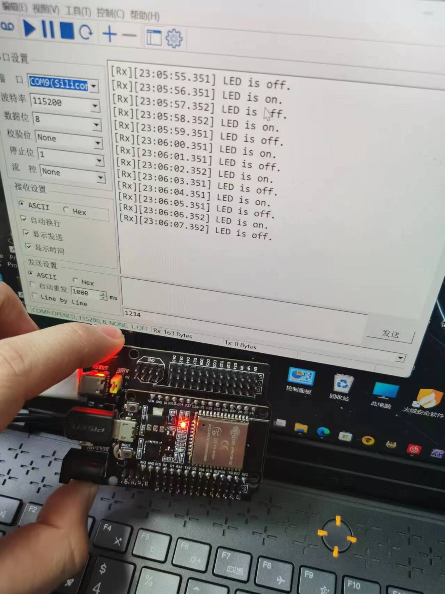

# ESP32 Auto-Update Script-micropython（OTA）

## 简介

这是一个为 ESP32设备设计的自动更新脚本，将`boot.py`文件烧录到ESP32的设备上即可，每次上电时，会自动从远程服务器下载最新的 `main.py` 文件进行更新。
## 功能特性

- **Wi-Fi 连接**: 自动连接到预设的 Wi-Fi 网络。
- **远程文件获取**: 从 Gitee 仓库获取最新的 `main.py` 文件。
- **文件更新**: 将远程文件的内容逐块写入本地 `main.py`。
- **内存管理**: 使用垃圾回收机制优化内存使用。
- **异常处理**: 在 Wi-Fi 连接失败时提供错误信息并终止程序。

## 安装与配置

### 配置 Wi-Fi

在脚本顶部设置你的 Wi-Fi SSID 和密码:


```python 
SSID = "your_wifi_ssid" 
PASSWORD = "your_wifi_password"
```

### 更新 URL

根据需要更新 `url` 变量指向你的远程 `main.py` 文件地址:
```python
url = 'https://your_remote_repo/main.py'
```

## 使用方法

1. 将此脚本上传到 ESP32设备。
2. 确保设备已连接到电源并且可以访问互联网。
3. reset主设备
## 测试




## 注意事项

- 确保远程服务器上的 `main.py` 文件是可公开访问的。
- 脚本中的垃圾回收调用有助于减少内存碎片，适用于资源有限的设备。
- 如果 Wi-Fi 连接不稳定，可能需要增加重试机制来提高脚本的健壮性。

## 示例输出


